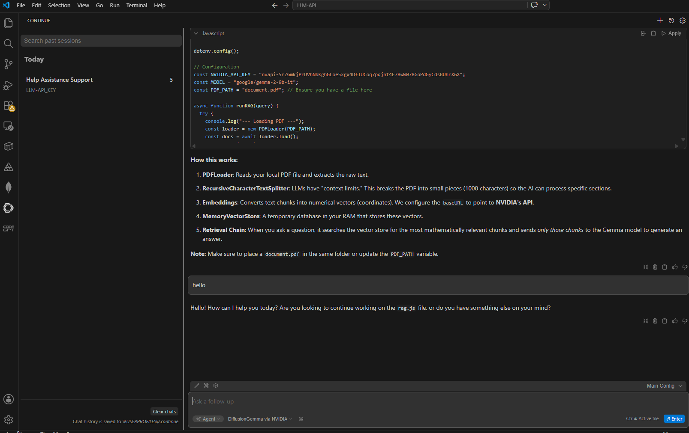
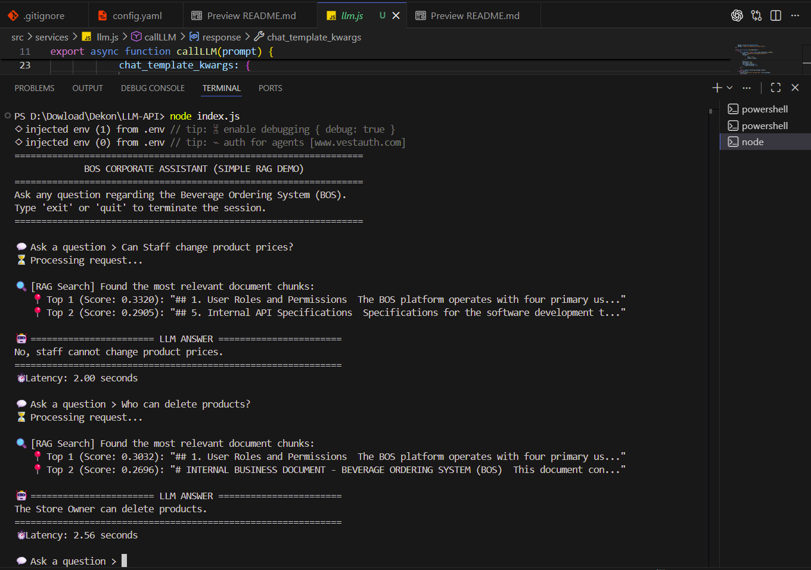

# BÁO CÁO NGHIÊN CỨU & THỰC HÀNH: TÍCH HỢP CUSTOM LLM VÀ XÂY DỰNG RAG QUA API KEY

Báo cáo này trình bày kết quả tìm hiểu và triển khai thực tế việc sử dụng **AI API Key** (thay vì các dịch vụ model đóng gói sẵn như GPT-4, GPT-5.5...) nhằm tối ưu hóa chi phí, tăng tính bảo mật dữ liệu doanh nghiệp và khả năng tùy biến sâu. 

Model sử dụng: **google/diffusiongemma-26b-a4b-it**

Nội dung báo cáo tập trung vào 2 phần hành động cụ thể đã được triển khai thành công:
1. **Tích hợp Custom Model** vào công cụ trợ lý lập trình **Continue** sử dụng API Key riêng.
2. **Xây dựng ứng dụng RAG (Retrieval-Augmented Generation)** cơ bản để cung cấp ngữ cảnh nội bộ của doanh nghiệp cho AI.

---

## I. Tổng quan: Tại sao nên dùng AI API Key thay cho các Model có sẵn?

*   **Tối ưu hóa chi phí:** Thay vì trả phí thuê bao cố định hàng tháng cho từng user (như ChatGPT Plus, Claude Pro), việc sử dụng API giúp doanh nghiệp chỉ trả tiền cho số lượng token thực tế sử dụng (Pay-as-you-go).
*   **Tính linh hoạt cao:** Dễ dàng thay đổi giữa các mô hình khác nhau (Closed-source vs Open-source) tùy theo bài toán cụ thể mà không bị phụ thuộc vào một nhà cung cấp duy nhất (Vendor lock-in).
*   **An toàn và Bảo mật dữ liệu:** Dữ liệu gửi qua API thương mại thường đi kèm cam kết không sử dụng để huấn luyện lại mô hình (Zero Data Retention), đảm bảo an toàn thông tin nội bộ.
*   **Khả năng tùy biến và mở rộng:** Cho phép tích hợp trực tiếp vào quy trình làm việc tự động (CI/CD, Extension phát triển phần mềm) và xây dựng hệ thống RAG riêng cho dữ liệu của doanh nghiệp.

---

## II. Phần 1: Tích hợp & Thay thế Model trong Extension "Continue"

### 1. Giới thiệu về Continue
**Continue** là một extension mã nguồn mở dành cho VS Code và JetBrains, cho phép lập trình viên tạo lập một trợ lý AI cá nhân hóa ngay trong môi trường code. 

### 2. Triển khai cấu hình Custom Model (sử dụng file `config.yml`)
Thay vì sử dụng các model mặc định có sẵn, chúng ta tiến hành cấu hình lại file `config.yml` của Continue để gọi custom model thông qua API Key của NVIDIA NIM:

```yaml
name: My Config
version: 1.0.0
schema: v1

models:
  - name: DiffusionGemma via NVIDIA
    provider: openai
    model: google/diffusiongemma-26b-a4b-it
    apiKey: nvapi-XXXXXXXXXXXXXXXXXXXXXXXXXXXXXXXXXXXXXXXXXXXXXXXXXXXXXXXXXXXX
    apiBase: https://integrate.api.nvidia.com/v1
    roles:
      - chat
      - edit
      - apply
      - autocomplete
    requestOptions:
      extraBody:
        temperature: 1.00
        top_p: 0.95
        chat_template_kwargs:
          enable_thinking: true
```

#### Giải thích chi tiết các trường cấu hình:
*   `name`: Tên định danh của cấu hình.
*   `version` & `schema`: Chỉ định phiên bản định dạng cấu hình của tiện ích Continue.
*   `models`: Khai báo danh sách các model sẽ tích hợp vào trợ lý lập trình.
    *   `name`: Tên hiển thị của mô hình trên giao diện làm việc.
    *   `provider`: Chọn `openai` vì API NVIDIA được thiết kế tương thích hoàn toàn với chuẩn giao thức của OpenAI.
    *   `model`: Đường dẫn model cụ thể (`google/diffusiongemma-26b-a4b-it`).
    *   `apiKey`: API Key dùng để xác thực quyền truy cập dịch vụ (đã được thay bằng chuỗi kí tự ẩn `nvapi-XXXXX...` để đảm bảo an toàn thông tin).
    *   `apiBase`: Địa chỉ endpoint của NVIDIA API (`https://integrate.api.nvidia.com/v1`).
    *   `roles`: Các tác vụ mà model này sẽ đảm nhận, bao gồm:
        *   `chat`: Hỏi đáp, hỗ trợ trực tiếp.
        *   `edit`: Chỉnh sửa hoặc refactor các đoạn mã hiện có.
        *   `apply`: Đưa các gợi ý từ chat vào file code.
        *   `autocomplete`: Tự động điền code (gợi ý inline khi đang gõ).
    *   `requestOptions`: Cấu hình tham số gửi yêu cầu.
        *   `extraBody`: Chứa các thiết lập nâng cao như `temperature` (độ sáng tạo), `top_p` (xác suất lựa chọn token) và đặc biệt là `chat_template_kwargs: { enable_thinking: true }` để kích hoạt cơ chế suy nghĩ/lập luận sâu của dòng mô hình DiffusionGemma.

### 3. Kết quả triển khai
Dưới đây là hình ảnh minh chứng việc tích hợp thành công custom model trong giao diện làm việc của Continue:



---

## III. Phần 2: Xây dựng RAG (Retrieval-Augmented Generation) cung cấp ngữ cảnh cho AI

### 1. Khái niệm RAG đơn giản
RAG (Retrieval-Augmented Generation) giúp khắc phục nhược điểm "ảo tưởng" (hallucination) và thiếu thông tin thời gian thực của LLM. Bằng cách trích xuất dữ liệu từ cơ sở tri thức nội bộ (Knowledge Base) và ghép trực tiếp vào Prompt đầu vào làm ngữ cảnh (Context), LLM sẽ chỉ trả lời dựa trên thông tin được cung cấp.

### 2. Cấu trúc mã nguồn ứng dụng RAG (tích hợp Vector Database local)
Hệ thống RAG được tổ chức dạng các mô-đun (modular structure) để dễ mở rộng và bảo trì:
*   **Cơ sở tri thức (`company_kb.md`):** Lưu trữ tài liệu chính sách của BOS.
*   **Bộ tạo Embedding (`src/services/embedding.js`):** Gọi model `nvidia/nv-embedqa-e5-v5` qua API của NVIDIA để chuyển văn bản/câu hỏi thành vector (1024 chiều).
*   **Cơ sở dữ liệu Vector (`src/services/vectordb.js`):** Cung cấp giải pháp cơ sở dữ liệu vector local dựa trên tệp JSON (`src/db/vector_store.json`), hỗ trợ tính độ tương đồng Cosine (Cosine Similarity) để tìm ra đoạn văn bản khớp nhất.
*   **Bộ gọi LLM (`src/services/llm.js`):** Gọi model `google/diffusiongemma-26b-a4b-it` suy luận.
*   **Script nạp dữ liệu (`src/ingestion.js`):** Đọc tệp tri thức, chia nhỏ thành các đoạn nội dung (chunks), tạo vector và lưu vào file database JSON local.
*   **Bộ điều phối RAG (`src/rag.js`):** Nhận câu hỏi, tìm kiếm ngữ cảnh thích hợp nhất từ Vector DB, ghép thành prompt hoàn chỉnh gửi tới LLM.
*   **Giao diện tương tác (`index.js`):** Giao diện CLI hỏi đáp thời gian thực.

#### Mã nguồn điều phối RAG (`src/rag.js`):
```javascript
import { getEmbedding } from "./services/embedding.js";
import { searchSimilarity } from "./services/vectordb.js";
import { callLLM } from "./services/llm.js";

export async function runRAG(question) {
    // 1. Chuyển đổi câu hỏi thành vector embedding (isQuery = true)
    const queryVector = await getEmbedding(question, true);
    
    // 2. Tìm kiếm các đoạn tài liệu tương đồng nhất (Top 2 đoạn khớp nhất)
    const matchedChunks = searchSimilarity(queryVector, 2);
    
    // 3. Kết hợp các đoạn tài liệu tìm được làm context
    const context = matchedChunks.map(chunk => chunk.text).join("\n\n---\n\n");
    
    // 4. Xây dựng prompt kèm ngữ cảnh chọn lọc
    const prompt = `
You are an AI assistant.
Answer ONLY using the context below.
If the answer is not in the context, say: "I don't know based on the provided context."

Context:
${context}

Question:
${question}
`;

    // 5. Gửi tới LLM để sinh câu trả lời
    const answer = await callLLM(prompt);
    return answer;
}
```


### 3. Thông tin về Model đang sử dụng (`google/diffusiongemma-26b-a4b-it`)

Ứng dụng đang gọi API của NVIDIA NIM để sử dụng mô hình **DiffusionGemma** (`google/diffusiongemma-26b-a4b-it`). Đây là một dòng model tiên tiến của Google DeepMind với các đặc điểm nổi bật sau:

*   **Cơ chế Text-Diffusion (Không tự hồi quy):** Khác với các LLM truyền thống sinh từng token một cách tuần tự (autoregressive), DiffusionGemma tạo ra cả một khối văn bản song song cùng lúc bằng cách khử nhiễu lặp đi lặp lại. Điều này giúp giảm độ trễ (latency) và tăng tốc độ sinh văn bản lên tới 4 lần.
*   **Kiến trúc Mixture of Experts (MoE):** Được phát triển dựa trên Gemma 4 MoE với quy mô 26 tỷ tham số tổng (26B), nhưng chỉ có 3.8 tỷ tham số kích hoạt khi suy luận (active parameters), giúp tối ưu hiệu năng tính toán cực tốt.
*   **Tối ưu hóa bởi NVIDIA NIM:** Được cấu hình chạy trên nền tảng suy luận của NVIDIA (NVIDIA NIM) giúp xử lý tốc độ cao (có thể đạt trên 1100 tokens/giây trên các GPU H100) và tối ưu hóa bộ nhớ tốt qua chuẩn FP8.
*   **Hỗ trợ cơ chế Tư duy (Thinking Mode):** Mô hình hỗ trợ cấu hình `"chat_template_kwargs": {"enable_thinking": true}` giúp nó có thể "suy nghĩ" và lập luận logic trước khi đưa ra câu trả lời cuối cùng, tương tự cơ chế của các mô hình lý luận (Reasoning Models) hiện đại.
*   **Context Window cực lớn:** Hỗ trợ xử lý ngữ cảnh lên đến 256K token và có khả năng đa phương tiện (multimodal).

---

### 4. Kết quả chạy thử nghiệm ứng dụng RAG
Khi người dùng đặt câu hỏi liên quan đến chính sách kinh doanh hoặc thông số kỹ thuật của BOS (ví dụ: các quyền hạn của role Staff, chính sách hoàn tiền khi hủy đơn, bảng giá đồ uống...), hệ thống RAG truy xuất chính xác ngữ cảnh từ `company_kb.md` và trả lời ngắn gọn, chuẩn xác.

Dưới đây là hình ảnh kết quả chạy thực tế ứng dụng RAG trong terminal:



---

## IV. Hướng dẫn chạy thử nghiệm mã nguồn RAG tại local

### 1. Chuẩn bị môi trường
*   Cài đặt [Node.js](https://nodejs.org/) (phiên bản 18 trở lên).
*   Đăng ký và lấy API Key từ NVIDIA NIM hoặc các dịch vụ cung cấp API LLM tương tự.

### 2. Cài đặt các bước
1.  **Cài đặt các gói phụ thuộc (dependencies):**
    ```bash
    npm install
    ```
2.  **Thiết lập file cấu hình môi trường:**
    Tạo file `.env` tại thư mục gốc từ file `.env.example` và điền API key của bạn:
    ```env
    NVIDIA_API_KEY=your_actual_nvidia_api_key_here
    ```
3.  **Chạy script nạp tài liệu (Ingestion) để tạo database vector local:**
    ```bash
    node src/ingestion.js
    ```
    *Lưu ý: Bạn chỉ cần chạy script này một lần duy nhất khi khởi tạo dự án hoặc khi tài liệu `company_kb.md` có sự cập nhật.*
4.  **Khởi động ứng dụng CLI:**
    ```bash
    node index.js
    ```
5.  **Đặt câu hỏi tương tác:**
    Nhập các câu hỏi liên quan đến hệ thống BOS (ví dụ: *"What can a Staff role do?"* hoặc *"What is the refund rate for cancelling after 5 minutes?"*) để kiểm chứng tính hiệu quả của RAG.

---

## V. Kết luận & Hướng phát triển

*   **Kết luận:** Phương pháp sử dụng API Key kết hợp tự xây dựng RAG giúp doanh nghiệp hoàn toàn làm chủ công nghệ, bảo mật thông tin tối đa và linh hoạt tùy biến giao diện cũng như mô hình sử dụng với chi phí cực kỳ tối ưu.
*   **Hướng phát triển:** 
    *   **Nâng cấp cơ chế RAG sang Vector Search RAG:**
        *   *Hạn chế của RAG hiện tại (Context Injection thô):* Hiện tại, chúng ta đang đọc toàn bộ nội dung tệp tri thức `company_kb.md` rồi "nhồi" trực tiếp vào prompt để làm ngữ cảnh. Phương pháp này chỉ phù hợp với tài liệu ngắn. Khi cơ sở dữ liệu doanh nghiệp phình to hàng trăm hoặc hàng ngàn trang, việc nhồi toàn bộ sẽ làm **vượt quá giới hạn ngữ cảnh (Context Window)** của LLM, **tăng chi phí token** đáng kể và gây ra hiện tượng **nhiễu thông tin** (khiến mô hình bỏ sót chi tiết quan trọng ở giữa văn bản - "Lost in the Middle").
        *   *Giải pháp Vector và lý do cần sử dụng:*
            1.  **Vector Embedding:** Chuyển đổi dữ liệu văn bản từ ngôn ngữ tự nhiên thành các chuỗi số (vector) đại diện cho ngữ nghĩa của chúng. Các đoạn văn có ý nghĩa tương đương nhau sẽ có tọa độ không gian vector gần nhau.
            2.  **Vector Database (như Pinecone, Milvus, ChromaDB):** Hệ cơ sở dữ liệu chuyên dụng để lưu trữ và truy vấn nhanh các vector này.
            3.  **Cơ chế tìm kiếm tương đồng (Similarity Search):** Khi người dùng đặt câu hỏi, câu hỏi đó cũng được vector hóa. Hệ thống thực hiện tính toán độ tương đồng (ví dụ: Cosine Similarity) để tìm ra 3-5 đoạn văn bản liên quan mật thiết nhất với câu hỏi trong hàng triệu dòng tài liệu, thay vì phải gửi cả file lớn.
            4.  **Hiệu quả:** Cách tiếp cận này giúp tiết kiệm token tối đa, giảm thời gian phản hồi (latency), và duy trì độ chính xác cực cao ngay cả khi cơ sở dữ liệu doanh nghiệp mở rộng quy mô lớn.
    *   Tối ưu hóa tốc độ phản hồi (latency) bằng cách tinh chỉnh temperature và cấu hình stream câu trả lời.

---

## 🎥 Video Demo

[

> Click the image above to watch the demo on YouTube.
